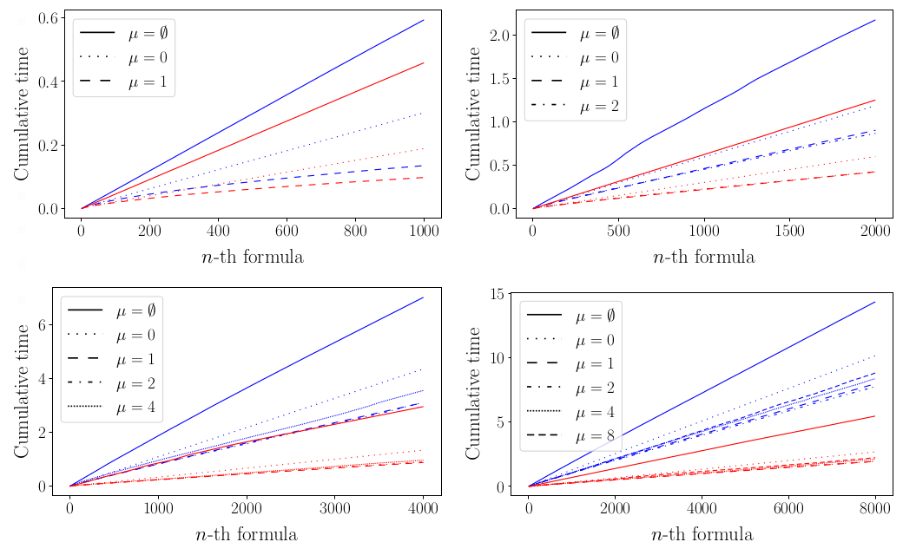

# OVERLAY2022

# Multi-Models and Multi-Formulas Model Checking for Modal Logic Formulas Induction

by Mauro Milella, 
Giovanni Pagliarini, 
Andrea Paradiso, 
Ionel Eduard Stan

## Abstract

> Modal symbolic learning is the subfield of artificial intelligence that brings together machine learning
> and modal logic to design algorithms that extract modal logic theories from data. The generalization
> of model checking to multi-models and multi-formulas is key for the entire inductive process (with
> modal logics). We investigate such generalization by, first, pointing out the need for model checking in
> automatic inductive reasoning, and, then, show how to efficiently solve it. We release an open-source
> implementation of our simulations.

## Software usage

The purpose of this module is to, given a certain parametrization, compute model-checking over multiple models and multiple formulas. Also, results are plotted showing how much time it's saved/wasted by performing (sub)formulas memoization.
The core of the code can be found in `src`.

Please, use the following command to run:

    julia --project=. src/experiments.jl --nmodels N_MODELS --nworlds N_WORLDS --nletters N_LETTERS --fmaxheight F_MAXHEIGHT --fmemo F_MEMO --nformulas N_FORMULAS --prfactor PR_FACTOR --nreps N_REPS

An utility bash script is provided (see `src/launch_experiments.sh`) to enqueue the execution of more parametrizations, instead of manually launching the command above.
Simply change the arrays at the start of the script.

The generated plot is saved in `outcomes/plots`. Each execution it's also associated with a csv (created in `outcomes/csv`) useful to adjust and customize plottings with ad-hoc scripts: in this regard, an example python script is provided (it's placed in the latter director) to obtain results graphically similar to those presented in the paper. 

## Dependencies

TODO: installing all the dependencies could be a tedious procedure that could be automated with a simple script. This section should refers to specific a specific, working branch of SoleModelChecking.

## Examples 

*Insert a brief description here.*