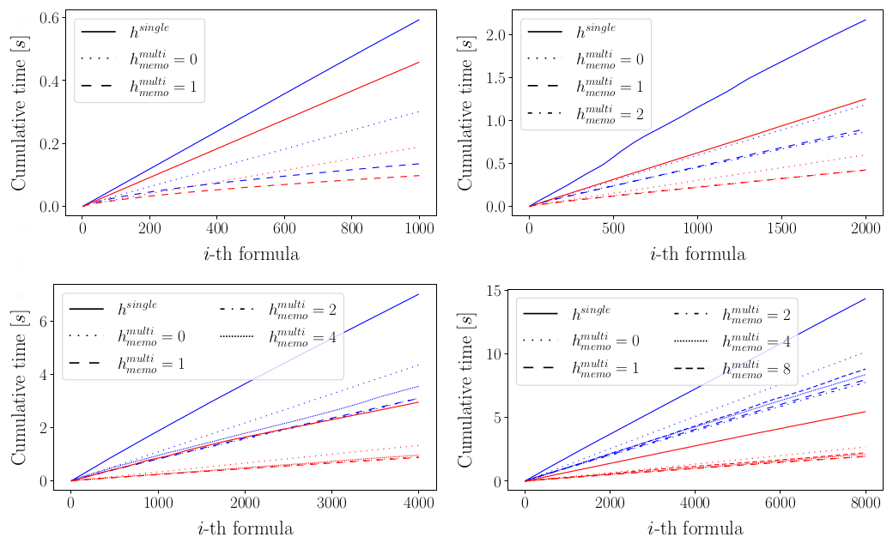

# OVERLAY2022

# Multi-Models and Multi-Formulas Model Checking for Modal Logic Formulas Induction

by Mauro Milella, 
Giovanni Pagliarini, 
Andrea Paradiso, 
Ionel Eduard Stan

## Abstract

> Modal symbolic learning is the subfield of artificial intelligence that brings together machine learning
> and modal logic to design algorithms that extract modal logic theories from data. The generalization
> of model checking to multi-models and multi-formulas is key for the entire inductive process (with
> modal logics). We investigate such generalization by, first, pointing out the need for model checking in
> automatic inductive reasoning, and, then, show how to efficiently solve it. We release an open-source
> implementation of our simulations.

## Software usage

Given a specific parametrization, the purpose of this module is to compute model-checking over multiple models and multiple formulas. Results are plotted, comparing the time elapsed with different memoization intensities.

Please, install the required dependencies by running

    julia --project=. src/install.jl

Then, the code can be executed by launching the following command:

    julia --project=. src/experiments.jl --nmodels N_MODELS --nworlds N_WORLDS --nletters N_LETTERS --fmaxheight F_MAXHEIGHT --fmemo F_MEMO --nformulas N_FORMULAS --prfactor PR_FACTOR --nreps N_REPS

A utility bash script is provided (see `src/launch_experiments.sh`) to enqueue the execution of more parametrizations, instead of manually launching the command above.

The generated plot is saved in `outcomes/plots`. Each execution it's also associated with a CSV (created in `outcomes/csv`) useful to adjust and customize plottings with ad-hoc scripts: in this regard, an example python script is provided (it's placed in the latter director) to obtain results graphically similar to those presented in the paper. 

## Examples 

Results of the multi-models and multi-formulas model checking with the single and shared memoization approaches with varying values of $h_{\max}$. Each subfigure shows the cumulative time achieved by the different approaches with $pr=0.2$ (in blue) and $pr=0.5$ (in red).

<b>Figure 1:</b> $|K|=50$, $|W|=20$, $|P|=2$, $h_{max}\in\{1,2,4,8\}$, $pr\in\{0.2,0.5\}$, $|N|\in\{1000,2000,4000,8000\}$

The blue group in the latter plot (fourth quadrant) is generated by the following command:

    julia --project=. src/experiments.jl --nmodels 50 --nworlds 20 --nletters 2 --fmaxheight 8 --fmemo "no,0,1,2,4,8" --nformulas 8000 --prfactor 0.2 --nreps 10000

<b>Figure 2:</b> $|K|=50$, $|W|=20$, $|P|=16$, $h_{max}\in\{1,2,4,8\}$, $pr\in\{0.2,0.5\}$, $|N|\in\{1000,2000,4000,8000\}$

Below, the maximum possible speedup for each $h_{max}$ and $pr$ combination in the latter figure.

| Max Speedup Table | $h_{max}=1$ | $h_{max}=2$ | $h_{max}=4$ | $h_{max}=8$ |
| ---      | --- | --- | --- | --- |
| $pr=0.2$ |  $371\%$   |  $150\%$   |  $125\%$   |  $85\%$   |
| $pr=0.5$ |  $366\%$   |  $195\%$   |  $229\%$   |  $180\%$   |